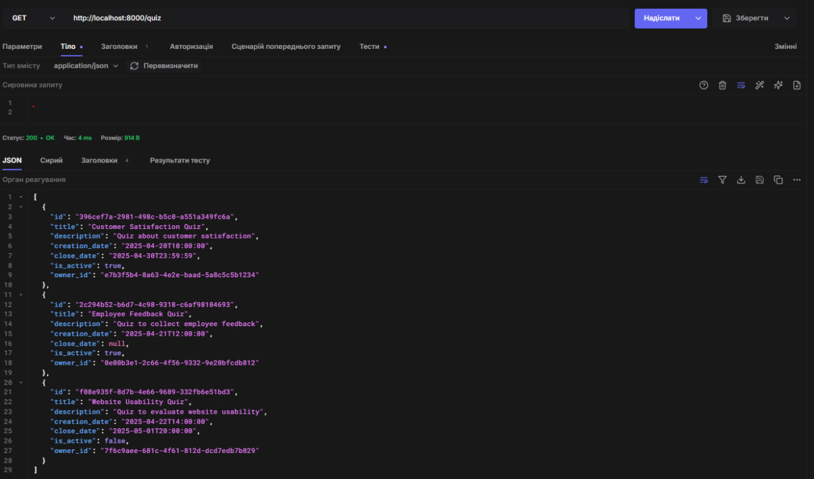
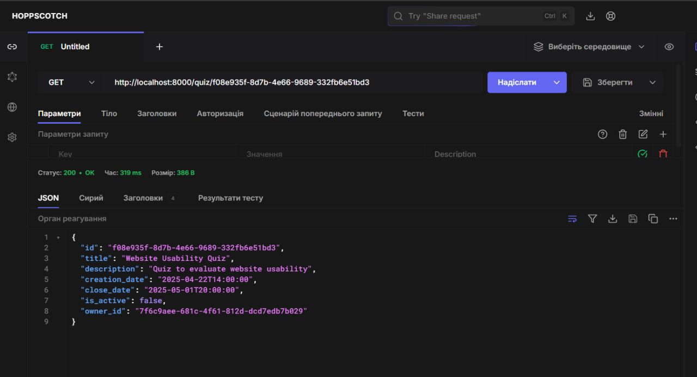
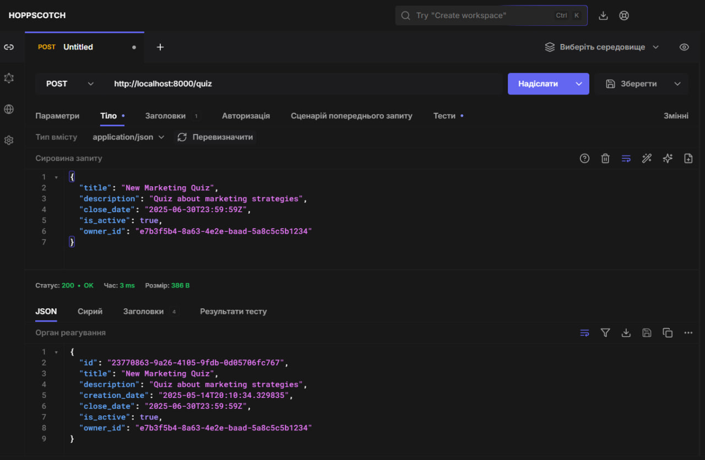
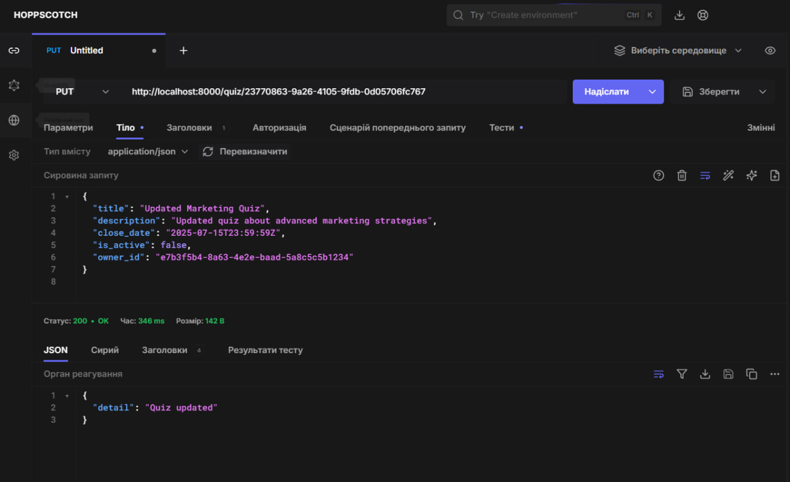
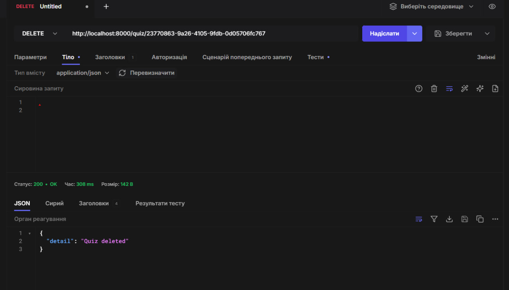

# Тестування працездатності системии

## Передумови

### 1. Встановити залежнсті проекту

python -m venv venv

### 2. Запустити сервер

uvicorn test:app --reload

## Перевірка працездатности сервісів

### GET: отримати всі вікторини

### GET: отримати одну вікторину

### POST: створити нову вікторину

### PUT: оновити вікторину

### DELETE: вилучити вікторину

